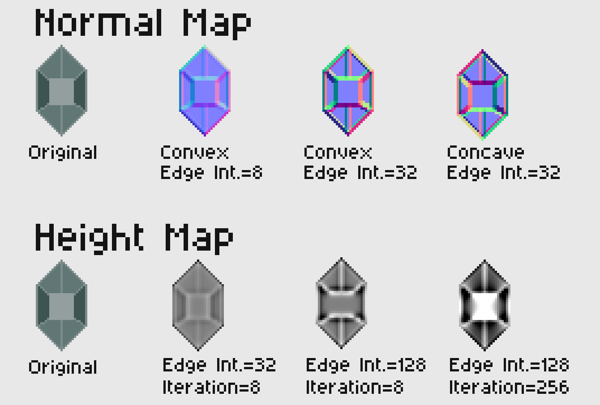
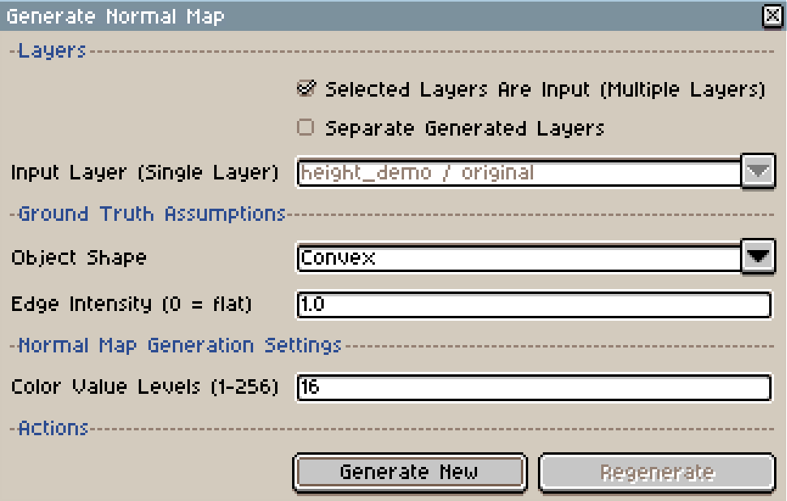
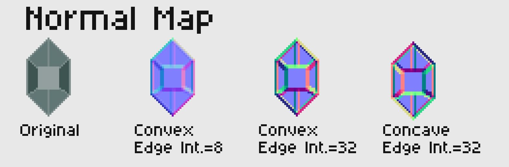
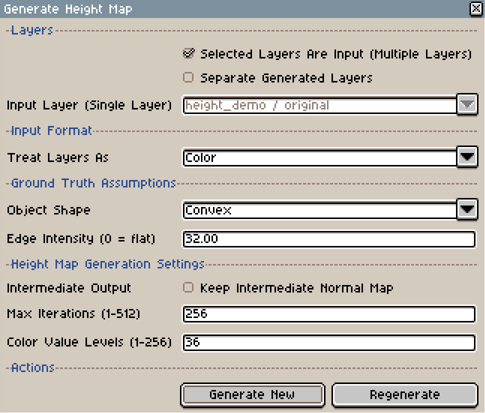
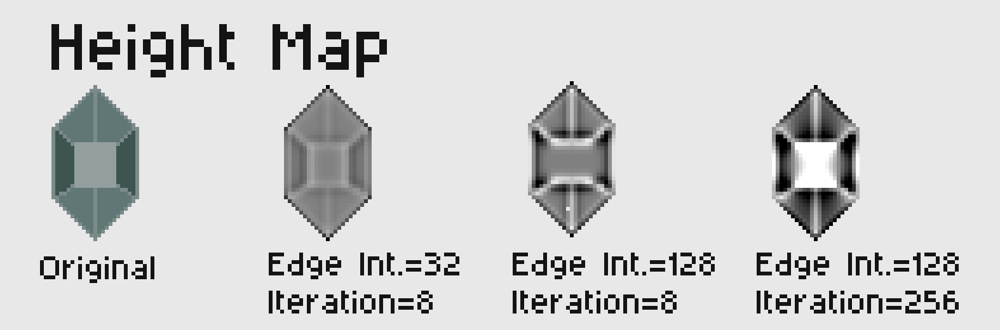

# Aseprite Texture Map Generator Extension

All-In-One Image Processing based texture map generator extension for [Aseprite](https://github.com/aseprite/aseprite)  that enables unified and easy 2D texture map creation pipelines.  

**Supported Features:**  

- Normal Map Generation
- Height Map Generation
- Specular Map Generation (Work In Progress...)
- Emission Map Generation (Work In Progress...)



## Building Extension File

### Download this project, then use one of the following ways  

**1. Build Script (Need Unix / Bash Environment):**  

```
chmod +x ./build.sh && ./build.sh
```

**2. Manual Method:**  

- Zip `src/`, `package.json`, and `LICENSE` into a `.zip` file and rename the file extension to `.aseprite-extension`
- DO NOT zip the submodules in the `lib/` folder.

## Installing the Extension

- In **Aseprite**, go to `Edit` > `Preferences` > `Extensions` and click `Add Extension`, then select the `.aseprite-extension` file to install.

## Using the Extension

Each texture-map submenu provides a `Dialog` command and a `Quick Generate` command. Quick generation skips the
dialog and uses the layer and map settings saved in the plugin preferences.

<small>*Note: Quick Command generates the texture map with settings set in the Dialog Panel*</small>  
<small>*Note: Recommended to add the Quick Commands to your keybinds via `Edit` -> `Keyboard Shortcuts` -> `Menus`*</small>  

### Normal Map Generation

**Quick Command Location:** : `Edit` > `FX` > `Texture Map Generator` > `Normal Map` > `Quick Generate Normal Map`  
**Dialog Panel Location**: `Edit` > `FX` > `Texture Map Generator` > `Normal Map` > `Generate Normal Map (Dialog)`  

#### Dialog

  

#### Normal Map Options

##### Normal Map: Layers

- `Selected Layers Are Input`: Default option, treats selected layers in the timeline below as input layers, allows multiple layers
- `Separate Generated Layers`: When checked, each selected layer will generate its own output with suffix `_normal` and insert on top of it, when unchecked, all selected layers will generate one single `Combined_normal` layer
- `Input Layer`: Only activated when `Selected Layers Are Input` is unchecked, use a single layer selected from the dropdown as the input layer, does not support multi-selection

##### Normal Map: Ground Truth Assumptions

- `Object Shape`: Tells the generator whether it should treat the selected layer(s) as `Concave` or `Convex` shape
- `Edge Intensity`: Tells the generator how high the edges are, the higher the value, the more ragged the generated output will be

##### Normal Map: Generation Settings

- `Color Value Levels`: The maximum discretized value allowed in each color channel, lower number produces a more pixelized style

#### Result Demo

  

### Height Map Generation

**Quick Command Location**: `Edit` > `FX` > `Texture Map Generator` > `Height Map` > `Quick Generate Height Map`  
**Dialog Panel Location**: `Edit` > `FX` > `Texture Map Generator` > `Height Map` > `Generate Height Map (Dialog)`  

#### Dialog

  

#### Height Map Options

##### Height Map: Layers

Same as [Normal Map: Layers](#normal-map-layers)

##### Height Map: Input Format

- `Treat Layers As`: Tells the generator whether it should treat the input layers as `Color` or `Normal`. If switched to Normal map, the generator will treat the input as normal and infer the height from it

##### Height Map: Ground Truth Assumptions

Same as [Normal Map: Ground Truth Assumptions](#normal-map-ground-truth-assumptions)

##### Height Map: Generation Settings

- `Intermediate Output`: When `Input Format` is set to `Color`, the generator will need to generate a normal map first as an intermediate texture, check to keep that intermediate output
- `Iterations`: The heightmap generation algorithm needs a few iterations to converge, heigher iteration gives more accurate result while taking longer time to compute, maximum 512 iterations
- `Color Value Levels`: The maximum discretized value allowed in each color channel, lower number produces a more pixelized style
  
#### Result Demo  

  

## Development  

After cloning the repository, run the following command to initialize the submodule for [Aseprite Library](https://github.com/RampantDespair/Aseprite-Library) definitions:  

```
git submodule update --init --recursive
```

### Testing

#### Testing can be done in one of the following ways

**1. Using `test.sh` (Need Unix / Bash Environment):**

First, add a `.env` file in the **project root folder** with the following content:  

```env
ASEPRITE_BIN="your_path_to_aseprite_executable"
```

Second, run the following command:  

```
chmod +x ./test.sh && ./test.sh
```

**2. Using Aseprite's Lua runtime:**  

```
your_path_to_aseprite_executable -b --script ./tests/test_normal_map.lua
```

**3. Using your installed Lua runtime:**

```
lua ./tests/test_normal_map.lua
```

<small>*Note: Make sure [Lua 5.4](https://www.lua.org/versions.html#5.4) is installed*</small>
